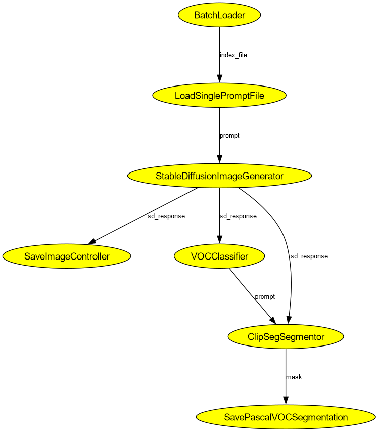

# syntagen-sol

This is our solution for the [Syntagen Challenge](https://syntagen.github.io/#:~:text=%2D%20mIoU%3A%2046.25-,SyntaGen%20Competition,-Dataset%20and%20metric). It is built on top of some research:
- [CLIP-ES](https://arxiv.org/abs/2212.09506)
- [CLIPSeg](https://arxiv.org/abs/2112.10003).
- [Stable Diffusion 1.5](https://huggingface.co/runwayml/stable-diffusion-v1-5) 


(Thanks to all the authors for their wonderful works)

## Installation

Requirement:
- MS visual C++14 build tool or greater. [installation here](https://visualstudio.microsoft.com/visual-cpp-build-tools/).
- Conda. [installation here](https://docs.anaconda.com/free/miniconda/).
- CUDA 11.7 with CuDNN installed. 

```bash
conda create -n <env_name> python==3.9
conda activate <env_name>
python -m pip install -r requirements.txt
```

## Execution

Execution flow is figured as below:

<p algin="center">

</p>

> CLIPSeg in the previous pipeline does not comply with the challenge rules. We apologize for missing a deep check of the method and violating the competition regulations. However, we still think it is a good solution for real-world problems. 

<details>
  <summary>Old pipeline</summary> 
<p algin="center">

</p>
</details>

To execute the pipeline, start the `run.sh` file:

```bash
bash run.sh 
```

Artifacts will be stored in the `data` folder:
- `data/mask/*.png`: store all mask files of VOC annotation.
- `data/image/*.jpg`: store all generated images.
